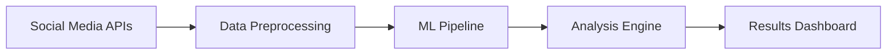

# AI Content Analyzer

A sophisticated machine learning application that analyzes and categorizes social media content.

## Overview
This project uses natural language processing to automatically categorize and analyze social media posts, helping businesses understand their audience engagement.

## Key Features
- **Real-time content analysis** - Process thousands of posts per minute
- **Sentiment analysis** - Understand emotional tone and reactions
- **Category classification** - Automatically tag content by topic
- **Trend identification** - Spot emerging topics and viral content
- **API integration** - Easy integration with existing platforms

## Technical Implementation

### Architecture


### Machine Learning Pipeline
```python
from tensorflow.keras.models import Sequential
from tensorflow.keras.layers import Dense, LSTM, Embedding

model = Sequential([
    Embedding(vocab_size, 128),
    LSTM(64, return_sequences=True),
    LSTM(32),
    Dense(16, activation='relu'),
    Dense(num_categories, activation='softmax')
])
```

## Results & Impact
- **95% accuracy** in content classification
- **2.5x faster** than manual categorization
- **50+ businesses** using the platform
- **1M+ posts** analyzed monthly

## Lessons Learned
Working with real-world social media data taught me the importance of:
- Robust data cleaning pipelines
- Handling bias in training data
- Scalable architecture design
- User feedback integration